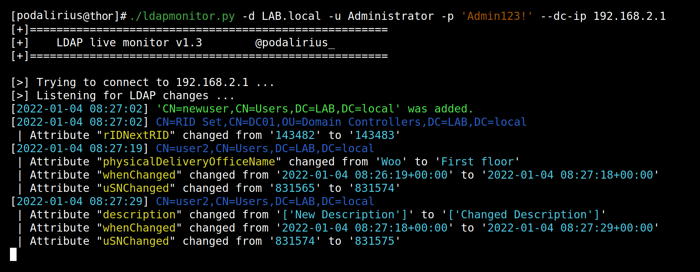
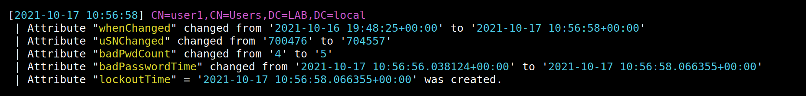
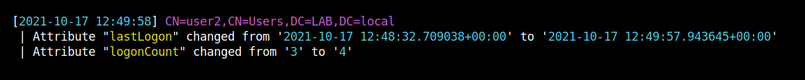
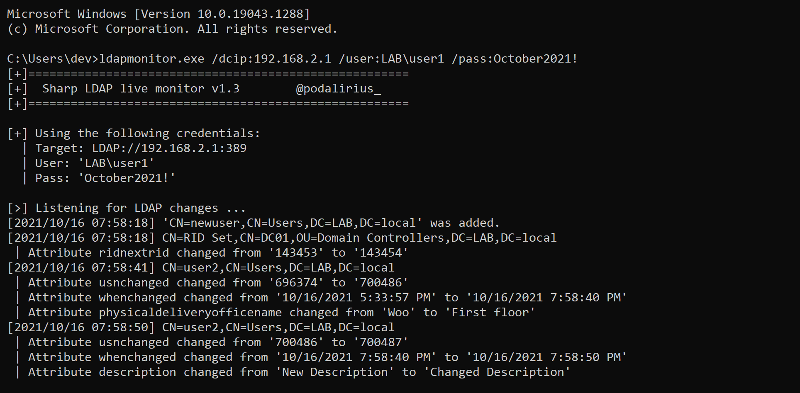

# LDAP Monitor

    Monitor creation, deletion and changes to LDAP objects live during your pentest or system administration!
     
    
    
    
    
     

With this tool you can quickly see if your attack worked and if it changed LDAP attributes of the target object.

## Features

| Feature | [Python (.py)](./python/) | [CSharp (.exe)](./csharp/) | [Powershell (.ps1)](./powershell/) |
|---------|--------|--------|------------|
| LDAPS support                                    | :heavy_check_mark: | :heavy_check_mark: | :heavy_check_mark: |
| Random delay in seconds between queries          | :heavy_check_mark: | :heavy_check_mark: | :heavy_check_mark: |
| Custom delay in seconds between queries          | :heavy_check_mark: | :heavy_check_mark: | :heavy_check_mark: |
| Save output to logfile                           | :heavy_check_mark: | :heavy_check_mark: | :heavy_check_mark: |
| Colored or not colored output with `--no-colors` | :heavy_check_mark: | :x:                | :x:                |
| Custom page size for paged queries               | :heavy_check_mark: | :heavy_check_mark: | :heavy_check_mark: |
| Authenticate with user and password              | :heavy_check_mark: | :heavy_check_mark: | :heavy_check_mark: |
| Authenticate as current shell user               | :x:                | :heavy_check_mark: | :heavy_check_mark: |
| Authenticate with LM:NT hashes                   | :heavy_check_mark: | :x:                | :x:                |
| Authenticate with kerberos tickets               | :heavy_check_mark: | :x:                | :x:                |
| Option to ignore user logon events               | :heavy_check_mark: | :heavy_check_mark: | :heavy_check_mark: |
| Custom search base                               | :heavy_check_mark: | :heavy_check_mark: | :heavy_check_mark: |
| Iterate over all naming contexts                 | :heavy_check_mark: | :heavy_check_mark: | :heavy_check_mark: |

## Typical use cases

Here is a few use cases where this tool can be useful:

 - Detect account lockout in real time
   

 - Check if your privilege escalation worked (with ntlmrelay's `--escalate-user` option)
   

 - Detect when users are login in to know when to start a network poisoning.
   
 
## Cross platform !

### [In Python (.py)](./python/)

### [In CSharp (.exe)](./csharp/)

### [In Powershell (.ps1)](./powershell/)

## Demonstration

https://user-images.githubusercontent.com/79218792/136900209-d2156d4c-d83d-4227-b51e-999ec99b2314.mp4

## Limitations

LDAP paged queries returns **pageSize** results per page, and it takes approximately 1 second to query a page. Therefore your monitoring refresh rate is **(number of LDAP objects // pageSize)** seconds. On most domain controllers **pageSize = 5000**.

## Contributing

Pull requests are welcome. Feel free to open an issue if you want to add other features.
