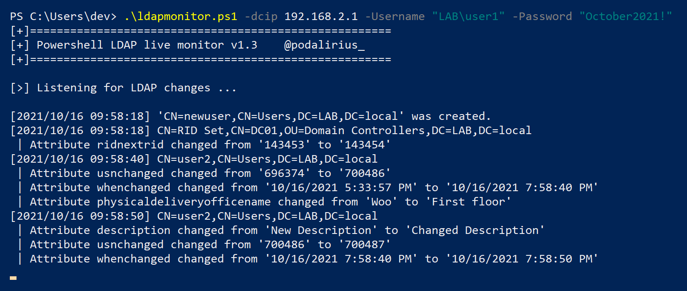

# Powershell LDAP Monitor

Monitor creation, deletion and changes to LDAP objects live during your pentest or system administration!

With this script you can quickly see if your attack worked and if it changed LDAP attributes of the target object. You can also directly see if you're locking accounts!



## Features

 - [x] LDAPS support.
 - [x] Random delay in seconds between queries.
 - [x] Custom delay in seconds between queries.
 - [x] Save output to logfile.
 - [x] Custom page size for paged queries.
 - [x] Multiple authentication methods:
   - with user and password.
   - as current shell user

## Limitations

LDAP paged queries returns **pageSize** results per page, and it takes approximately 1 second to query a page. Your monitoring refresh rate is **(number of LDAP objects // pageSize)** seconds. On most domain controllers **pageSize = 5000**.

## Usage

```
PS C:\Users\dev\> .\psLDAPmonitor.ps1 -Help
[+]======================================================
[+] Powershell LDAP live monitor v1.1      @podalirius_
[+]======================================================

Required arguments:
  -dcip       : LDAP host to target, most likely the domain controller.

Optional arguments:
  -Help       : Displays this help message
  -Username   : User to authenticate as.
  -Password   : Password for authentication.
  -PageSize   : Sets the LDAP page size to use in queries (default: 5000).
  -LDAPS      : Use LDAPS instead of LDAP.
  -LogFile    : Log file to save output to.
  -Delay      : Delay between two queries in seconds (default: 1).
  -Randomize  : Randomize delay between two queries, between 1 and 5 seconds.
```

## Quick start

- Authenticate with a password:

   ```powershell
   .\psLDAPmonitor.ps1 -dcip 192.168.2.1 -Username "LAB\user1" -Password "October2021!"
   ```

- Authenticate as the current shell user:

   ```powershell
   .\psLDAPmonitor.ps1 -dcip 192.168.2.1
   ```

## Contributing

Pull requests are welcome. Feel free to open an issue if you want to add other features.
